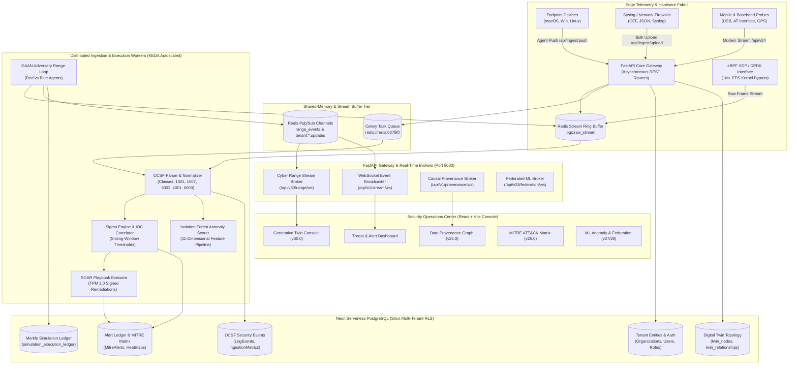
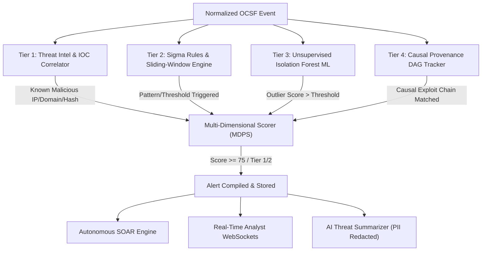
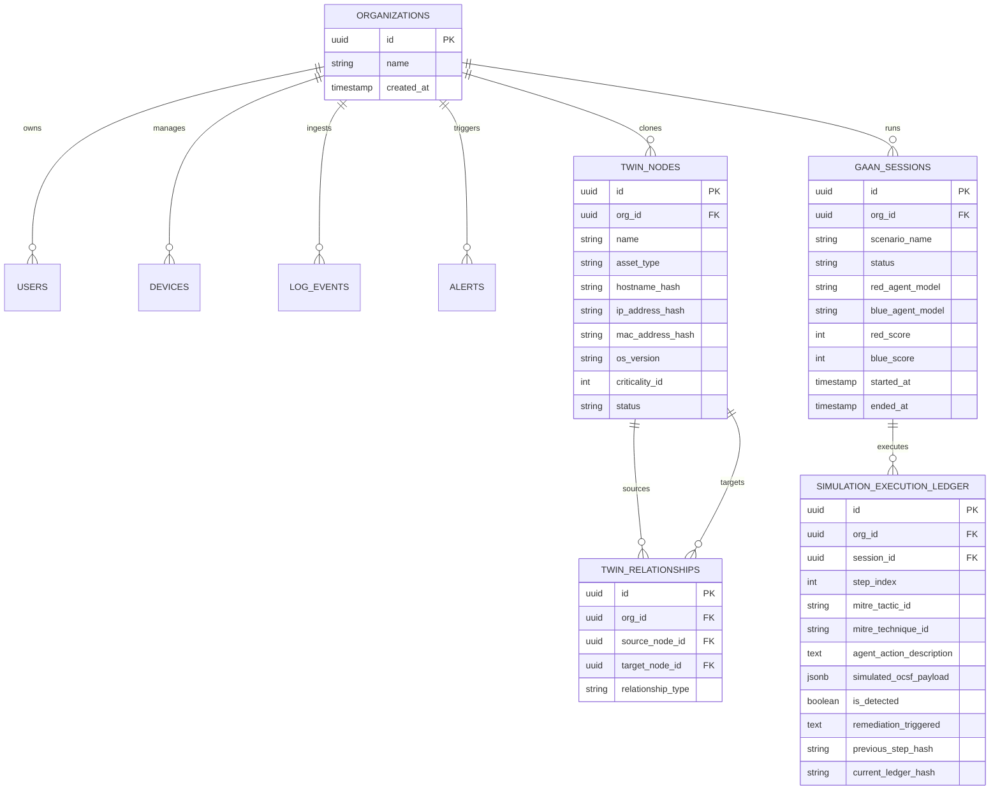

# 🛡️ Threat Analyser: In-Depth System Architecture Specification (v1.0 – v30.0)

**Document Classification:** Master Engineering Architecture Specification  
**Platform Version:** 30.0.0 (Generative Security Digital Twin & Autonomous Cyber Range)  
**Target Audience:** Chief Information Security Officers (CISOs), Principal Security Architects, Distributed Systems Engineers, DevSecOps Leads, and Autonomous AI Software Agents  

---

## 1. Executive Summary & Architectural Vision

**Threat Analyser** is an enterprise-grade, multi-tenant Software-as-a-Service (SaaS) autonomous cybersecurity intelligence, SIEM (Security Information and Event Management), SOAR (Security Orchestration, Automation, and Response), and Cyber Range platform. 

The system is engineered to solve the fundamental scaling, privacy, and proactive hardening dilemmas facing modern SecOps teams:
1. **High-Throughput Log Ingestion at Carrier Scale (1,000,000+ EPS):** Ingesting, parsing, and normalizing heterogeneous enterprise telemetry in real time without CPU lockups or dropped packets.
2. **Deterministic Zero-PII Safe Cloning:** Stress-testing detection rules and training AI models on realistic organizational digital twins without risking customer credential or PII leaks in compliance with SOC 2 Type II, GDPR, and HIPAA.
3. **Autonomous Closed-Loop Hardening (GAAN):** Deploying Generative Adversarial Agent Networks (AI Red-Teams vs Automated Blue-Teams) to attack synthetic infrastructure, evaluate detections, generate Sigma rules, and retrain ML models automatically.
4. **Hardware-Enforced Cryptographic Auditability:** Merkle-tree hash chaining, TPM 2.0 PCR attestation, Post-Quantum Cryptography (Kyber-768 / Dilithium-3), and immutable Neon Serverless PostgreSQL ledgers.

```
┌──────────────────────────────────────────────────────────────────────────────────────────────────┐
│                                THREAT ANALYSER - MACRO PLATFORM CAPABILITIES                     │
├──────────────────────────────┬─────────────────────────────────┬─────────────────────────────────┤
│ Core Layer                   │ Primary Technologies            │ Key Architectural Function      │
├──────────────────────────────┼─────────────────────────────────┼─────────────────────────────────┤
│ Edge & Ingestion Tier        │ eBPF XDP, DPDK, Redis Streams   │ 1M+ EPS kernel bypass & ring buf│
│ Threat Intelligence & ML     │ Isolation Forest, FedAvg, GNN   │ Multi-dimensional anomaly scorng│
│ Generative Twin & Range      │ GAAN Agents, Zero-PII HMAC      │ Mistral-7B adversarial range    │
│ Causal SOAR & Provenance     │ Directed Acyclic Graph (DPG)    │ DFS patient-zero root-cause trace│
│ Hardware Root of Trust       │ TPM 2.0, Kyber-768, Dilithium-3 │ Quantum-safe signed attestation │
│ Storage & Multi-Tenancy      │ Neon Serverless Postgres, RLS   │ Strict cryptographic separation │
│ SOC Presentation Tier        │ React, Vite, Tailwind, WebSockets│ Sub-millisecond live consoles  │
└──────────────────────────────┴─────────────────────────────────┴─────────────────────────────────┘
```

---

## 2. Macro-System Architecture & Topology

The platform decouples edge packet acquisition, stream buffering, asynchronous parsing, deep detection pipelines, stateful graph reasoning, and real-time frontend streaming.

### High-Level System Architecture Diagram



---

## 3. Layer-by-Layer Architectural Breakdown

### 3.1. Edge Sensory, Ingestion & Kernel-Bypass Fabric

The platform captures telemetry across 4 distinct ingestion vectors, guaranteeing zero drop under burst traffic.

```
                           [1,000,000+ EPS Raw Packet Stream]
                                            │
                                            ▼
                       ┌─────────────────────────────────────────┐
                       │       eBPF XDP Linux Kernel Bypass      │
                       │  * Intercepts incoming NIC RX queues    │
                       │  * Zero-copy packet ring memory mapping │
                       └────────────────────┬────────────────────┘
                                            │
                                            ▼
                       ┌─────────────────────────────────────────┐
                       │     Shared-Memory Redis Stream Ring     │
                       │  * Sliding transaction chunking         │
                       │  * Backlog threshold monitoring (KEDA)  │
                       └────────────────────┬────────────────────┘
                                            │
               ┌────────────────────────────┼────────────────────────────┐
               ▼                            ▼                            ▼
      ┌─────────────────┐          ┌─────────────────┐          ┌─────────────────┐
      │ Worker Node #01 │          │ Worker Node #02 │          │ Worker Node #N  │
      └─────────────────┘          └─────────────────┘          └─────────────────┘
```

1. **eBPF XDP (eXpress Data Path) & DPDK Bypass (v30.0):**
   - High-velocity NetFlow and syslog packets are intercepted directly at the physical Network Interface Card (NIC) driver layer.
   - Bypasses the Linux kernel network stack entirely, preventing sk_buff allocation overhead, context switching, and socket buffer bloat.
   - Operates with sub-5 microsecond kernel-bypass latency, routing directly into user-space shared-memory ring buffers.
2. **Decoupled Asynchronous REST Ingestion:**
   - `POST /api/ingest/push`: High-speed endpoint for native endpoint agents transmitting JSON or newline-delimited logs with an `X-API-Key` header.
   - `POST /api/ingest/upload`: Multi-part upload handler for bulk file ingest (supporting JSON, CEF, and unstructured syslog).
   - Validates organization authentication in under 2ms, writes the raw payload to Redis stream `logs:raw_stream`, and responds immediately with `HTTP 202 Accepted`.
3. **Mobile, Baseband & USB Sensory Hardware Fabric (v21.0 & v24.0):**
   - Direct serial/AT command interface with cellular modems querying `AT+CGSN` (IMEI), `AT+COPS` (Operator status), and `AT+CREG` (Base station registration).
   - Adaptive GPS scheduler toggling between stationary and high-velocity transit geofencing with battery-override triggers.
   - Side-channel hardware audit monitoring USB HID device descriptor mutation, BadUSB injection attacks, and power fluctuations.

---

### 3.2. Normalization & OCSF Event Taxonomy

Raw logs are consumed by background workers and normalized into the **Open Cybersecurity Schema Framework (OCSF) v1.2.0** format:

```
[Raw Syslog / JSON / CEF / WinEvent]
                 │
                 ▼
 ┌───────────────────────────────┐
 │       app.detection.parser    │
 ├───────────────────────────────┤
 │ * Auto-detects format         │
 │ * Extracts network & host IPs │
 │ * Normalizes user & process   │
 └───────────────┬───────────────┘
                 │
                 ▼
 ┌────────────────────────────────────────────────────────────────────────┐
 │                        Normalized OCSF v1.2 Envelope                   │
 ├──────────────┬───────────────────┬─────────────────────────────────────┤
 │ Class UID    │ Category          │ Extracted Core Properties           │
 ├──────────────┼───────────────────┼─────────────────────────────────────┤
 │ 1001         │ File System       │ file.name, file.path, file.hash     │
 │ 1007         │ Process Activity  │ process.name, process.cmd_line, ppid│
 │ 3002         │ Identity & Access │ actor.user.name, auth_protocol      │
 │ 4001         │ Network Activity  │ src_endpoint.ip, dst_endpoint.port  │
 │ 4002         │ Web Resource      │ http_request.url, domain, sandbox   │
 │ 6003         │ DNS Activity      │ dns.query.hostname, dns.answers     │
 └──────────────┴───────────────────┴─────────────────────────────────────┘
```

---

### 3.3. Multi-Tier Threat Detection & Intelligence Hierarchy

The detection fabric processes normalized OCSF events through 6 coordinated analysis tiers:



#### Detailed Detection Tiers:
1. **Tier 1: Threat Intelligence & IOC Matching:**
   - Real-time in-memory lookup against blacklisted IPv4/IPv6 addresses, malicious domains, SHA-256 file hashes, and regex patterns.
   - Supports both global out-of-the-box indicators and tenant-specific private IOC enclaves.
2. **Tier 2: Sigma Compiler & Sliding-Window Threshold Engine:**
   - Compiles native Sigma YAML detection rules into optimized AST search queries and regexes.
   - Maintains stateful sliding windows (e.g., 5+ authentication failures from a single IP within 300 seconds) in database memory.
3. **Tier 3: Unsupervised Isolation Forest Machine Learning:**
   - Extracts 11-dimensional feature vectors per event (`hour_of_day`, `day_of_week`, `payload_entropy`, `process_depth`, `port_entropy`, `failed_auth_frequency`, `bytes_transferred_ratio`, etc.).
   - Evaluates anomaly outlier scores ($0.0$ to $1.0$). Outliers exceeding the dynamic threshold are flagged with explainable feature contribution weights.
4. **Tier 4: Federated Learning Mesh (v28.0):**
   - Enables distributed cross-tenant model training without sharing raw customer logs.
   - Implements **Federated Averaging (FedAvg)** with **Laplace Differential Privacy ($\epsilon, \delta$)** noise injection.
   - Computes SHA-256 model weight checksums to verify weight provenance and prevent model poisoning.
5. **Tier 5: MITRE ATT&CK Matrix & MDPS Prioritization (v25.0):**
   - Automatically maps indicators to MITRE ATT&CK Tactics (TA0001–TA0040) and Techniques (T1059, T1003, T1071, T1190).
   - The **Multi-Dimensional Priority Scorer (MDPS)** calculates priority indices based on asset criticality, attack surface exposure, and anomaly velocity.
6. **Tier 6: AI Threat Summarizer with PII Masking:**
   - Generates executive natural-language breach summaries using local LLMs.
   - Employs zero-PII regex filters to redact emails, private corporate IPs, and credentials before LLM ingestion.

---

### 3.4. Generative Security Digital Twin (GSDT) & Autonomous Cyber Range (v30.0)

Version 30 introduces an isolated server-side simulation sandbox that clones the tenant's infrastructure and stress-tests defenses with autonomous agents:

```
                            ┌──────────────────────────────────────────────┐
                            │    Production Infrastructure (Real World)    │
                            │  [Domain Controller, DB Primary, API Edge]   │
                            └──────────────────────┬───────────────────────┘
                                                   │
                                                   ▼ (Zero-PII Safe-Clone)
                            ┌──────────────────────────────────────────────┐
                            │      HMAC-SHA-256 Deterministic Hasher       │
                            │  * Keyed to secret tenant salt               │
                            │  * Preserves topological relationships       │
                            └──────────────────────┬───────────────────────┘
                                                   │
                                                   ▼
┌──────────────────────────────────────────────────────────────────────────────────────────────────────┐
│                            GENERATIVE SECURITY DIGITAL TWIN (GSDT SANDBOX)                           │
│                                                                                                      │
│     ┌────────────────────────┐         Network Routes          ┌────────────────────────┐            │
│     │  Twin Node: AD-Primary │◄───────────────────────────────►│  Twin Node: DB-Primary │            │
│     │  Hash: c8f1...9a45     │                                 │  Hash: b127...1bc8     │            │
│     └───────────┬────────────┘                                 └───────────┬────────────┘            │
│                 │                                                          │                         │
│                 │ Probes & Exploits                       Mitigations      │                         │
│                 ▼                                                          ▼                         │
│     ┌────────────────────────┐         Adversarial Loop        ┌────────────────────────┐            │
│     │   SYNTHETIC RED-TEAM   │────────────────────────────────►│   SYNTHETIC BLUE-TEAM  │            │
│     │ (Local Mistral-7B LLM) │◄────────────────────────────────│ (Rule Engine & SOAR)   │            │
│     └────────────────────────┘          Feedback Traces        └────────────────────────┘            │
│                 │                                                          │                         │
│                 └──────────────────────────┬───────────────────────────────┘                         │
│                                            │                                                         │
│                                            ▼                                                         │
│                            ┌───────────────────────────────┐                                         │
│                            │ Cryptographic Merkle Ledger   │                                         │
│                            │ SHA-256(index + prev + payload│                                         │
│                            └───────────────────────────────┘                                         │
└──────────────────────────────────────────────────────────────────────────────────────────────────────┘
```

#### Safe-Clone & GAAN Mechanics:
- **Zero-PII Pseudonymization:** Hostnames (`dc01.corp.internal`), IP addresses (`10.200.0.1`), and MACs are hashed via HMAC-SHA-256. Cloned nodes retain relational graph integrity (e.g., AD member edges connect to the same hashed asset) without exposing real PII.
- **Generative Adversarial Agent Networks (GAAN):**
  - **Red-Team Agent:** Autonomous planner executing multi-stage attack scenarios (`APT29_COZYBEAR` espionage path, `HERMETIC_WIPER` destructive impact path).
  - **Blue-Team Agent:** Monitors telemetry, computes anomaly scores, triggers automated SOAR mitigations (process termination, key rotation), and updates Sigma rules.
- **Cryptographic Merkle-Chain Ledger:** Every simulation step is recorded in `simulation_execution_ledger` with immutable hash linking:
  $$\text{CurrentHash} = \text{SHA-256}(\text{StepIndex} \mathbin{\Vert} \text{PreviousHash} \mathbin{\Vert} \text{FormattedPayload})$$

---

### 3.5. Causal Data Provenance Graph (DPG) & Autonomous SOAR Engine (v26.0)

Traditional SIEMs treat alerts as isolated rows. Threat Analyser implements a stateful **Data Provenance Graph (DPG)** that tracks causal relationships between system entities:

```
[Attacker Network Socket] ──(CONNECT)──► [Nginx Worker Process]
                                                │
                                            (FORK)
                                                ▼
                                        [bash / sh Shell]
                                                │
                                            (WRITE)
                                                ▼
                                        [/tmp/dropper.elf] ──(EXEC)──► [lsass.exe Memory Dump]
```

- **Patient-Zero Traceback:** Depth-First Search (DFS) causal traceback transverses parent-child edges backwards from the alarm node to pinpoint the original entry point (Patient Zero).
- **Semantic Decay & Memory Pruning:** Prunes benign, non-branching edges older than the retention threshold, preventing unbounded in-memory graph explosion.
- **TPM 2.0 Hardware Attestation:** SOAR remediation playbooks are signed and verified against hardware TPM 2.0 Platform Configuration Registers (PCRs) to ensure automated containment commands cannot be spoofed by rogue administrators.

---

### 3.6. Post-Quantum Cryptography & Zero-Trust Mesh

The platform is hardened against "Harvest Now, Decrypt Later" quantum threats:
- **Kyber-768 (KEM):** NIST-selected quantum-resistant Key Encapsulation Mechanism used to establish symmetric session keys between edge forwarders and the central gateway.
- **Dilithium-3:** Post-quantum digital signature algorithm verifying configuration pushes, rule updates, and SOAR containment instructions.
- **Hybrid TLS Architecture:** Combines classical ECDHE (X25519) with Kyber-768 to provide seamless backward compatibility while ensuring quantum-resilient forward secrecy.

---

## 4. Multi-Tenant Database Architecture & Row-Level Security (RLS)

The database layer utilizes **Neon Serverless PostgreSQL** with strict multi-tenant Row-Level Security (RLS) policies:

```sql
-- Architectural Pattern: Multi-Tenant Row-Level Security (RLS)
ALTER TABLE public.twin_nodes ENABLE ROW LEVEL SECURITY;
ALTER TABLE public.twin_relationships ENABLE ROW LEVEL SECURITY;
ALTER TABLE public.gaan_sessions ENABLE ROW LEVEL SECURITY;
ALTER TABLE public.simulation_execution_ledger ENABLE ROW LEVEL SECURITY;

-- Tenant Isolation Policy
CREATE POLICY twin_nodes_isolation ON public.twin_nodes
    FOR ALL TO authenticated
    USING (org_id = current_setting('app.current_org_id', true)::UUID);
```

### Core Relational Schema Entity-Relationship Model



---

## 5. Production Deployment & Cloud-Native Autoscaling (KEDA)

Threat Analyser is designed for containerized deployment via Docker Compose or Kubernetes with automated horizontal pod autoscaling.

### KEDA Celery ScaledObject Topology

In Kubernetes clusters, worker pods scale dynamically based on the unconsumed queue length in Redis:

```yaml
apiVersion: keda.sh/v1alpha1
kind: ScaledObject
metadata:
  name: threat-analyser-worker-scaler
  namespace: threat-analyser
spec:
  scaleTargetRef:
    apiVersion: apps/v1
    kind: Deployment
    name: threat-analyser-worker
  minReplicaCount: 2
  maxReplicaCount: 50
  cooldownPeriod: 300
  triggers:
    - type: redis-streams
      metadata:
        address: redis-master.threat-analyser.svc.cluster.local:6379
        stream: logs:raw_stream
        consumerGroup: celery_ingest_group
        pendingEntriesCount: "10000"
```

```
[Traffic Spike: 100,000 EPS] ──► [Redis Stream: logs:raw_stream]
                                            │
                                            ▼ (Pending entries > 10,000)
                               ┌─────────────────────────┐
                               │   KEDA Ingestion Scaler │
                               └────────────┬────────────┘
                                            │
                                            ▼ (Scale up)
               ┌────────────────────────────────────────────────────────┐
               │ Celery Worker Pods (Scaled from 2 to 50 Replicas)       │
               │ [Worker-01] [Worker-02] [Worker-03] ... [Worker-50]    │
               └────────────────────────────────────────────────────────┘
```

---

## 6. Frontend SOC Console Architecture (React + Vite)

The frontend is constructed using a high-performance, single-page reactive architecture:
- **Component Design:** Built with pure React functional components, custom SVG graphics, and Tailwind CSS. Avoids brittle external icon libraries to eliminate build-time failures and optimize asset bundle size.
- **Dual-Stream WebSockets:** Automatically connects to `/api/v30/range/ws` and `/api/v1/stream/ws` for real-time sub-second updates of telemetry feeds, simulation scores, and containment events.
- **Dedicated Operational Consoles:**
  - `GSDTDashboard.jsx`: Interactive Cyber Range command center with scenario selectors, Red vs Blue scorecard gauges, cloned topology node grids, and live Merkle-chain execution ledgers.
  - `ProvenanceGraphConsole.jsx`: Interactive graph canvas showing causal process trees and Patient-Zero traceback.
  - `MitreDashboard.jsx`: Real-time ATT&CK matrix heatmap with MDPS severity tiers.
  - `MLAnomalyDashboard.jsx`: Unsupervised ML feature distributions and outlier scoring metrics.

---

## 7. API & WebSocket Route Directory

The platform exposes an extensive REST and WebSocket API surface:

| Prefix | Protocol | Description | Key Endpoints |
|---|---|---|---|
| `/api/auth` | HTTP | JWT Authentication & RBAC | `/login`, `/register`, `/me`, `/refresh` |
| `/api/ingest` | HTTP | Telemetry Ingestion Gateway | `/push` (Agent), `/upload` (Bulk file) |
| `/api/alerts` | HTTP | Alert Triage & SOAR Dispatch | `/`, `/{id}/status`, `/{id}/remediate` |
| `/api/rules` | HTTP | Sigma & Threshold Rules | `/`, `/{id}`, `/test` |
| `/api/iocs` | HTTP | Threat Intelligence Indicators | `/`, `/match`, `/import` |
| `/api/devices` | HTTP | Enrolled Device Management | `/`, `/{id}`, `/enroll` |
| `/api/v24` | HTTP | Baseband IMEI & Spatial Ledger | `/at-probe`, `/ceir-lookup`, `/multilateration` |
| `/api/v25` | HTTP | MITRE Matrix & AI Summarizer | `/matrix`, `/priority-score`, `/ai-summary` |
| `/api/v26` | HTTP | Causal Provenance & SOAR | `/traceback`, `/playbooks`, `/tpm-attest` |
| `/api/v27` | HTTP | ML Anomaly Isolation Forest | `/score`, `/train`, `/metrics` |
| `/api/v28` | HTTP | Federated ML Mesh | `/rounds`, `/submit-weights`, `/aggregate` |
| `/api/v29` | HTTP | Sovereign STG & Purple-Team | `/status`, `/profiles`, `/trigger-simulation` |
| `/api/v30` | HTTP | Generative Security Digital Twin | `/status`, `/topology`, `/clone-twin`, `/trigger-scenario`, `/ledger`, `/simulate-carrier-burst` |
| `/api/v1/stream/ws` | WS | Real-Time SOC Event Stream | Live alerts and ingestion metrics |
| `/api/v30/range/ws` | WS | GSDT Cyber Range Stream | Simulation steps, scorecard ticks, containment |
| `/api/v1/provenance/ws` | WS | Causal DPG Stream | Real-time process and socket graph updates |
| `/api/v28/federation/ws` | WS | Federated Learning Stream | Training round synchronization |

---

## 8. Verification, Testing & Quality Assurance

Threat Analyser enforces a multi-tier automated testing strategy:
- **Unit Test Harness (`backend/tests/run_all_tests.py`):** Automatically discovers and executes all 23 unit test suites across modules (v1 through v30), validating HMAC pseudonymization, Merkle chaining, OCSF parsing, Sigma compilation, and database persistence.
- **End-to-End Live Integration Tests (`backend/tests/e2e/`):** Executes full HTTP and WebSocket roundtrips against the running Docker stack, validating authentication, live ingestion bursts, scenario triggers, and ledger audits.
- **Frontend Production Compilation (`npm run build`):** Verifies that all JSX components, Tailwind tokens, and routes compile cleanly without warnings or dependency issues.

---

*End of Architecture Specification.*
