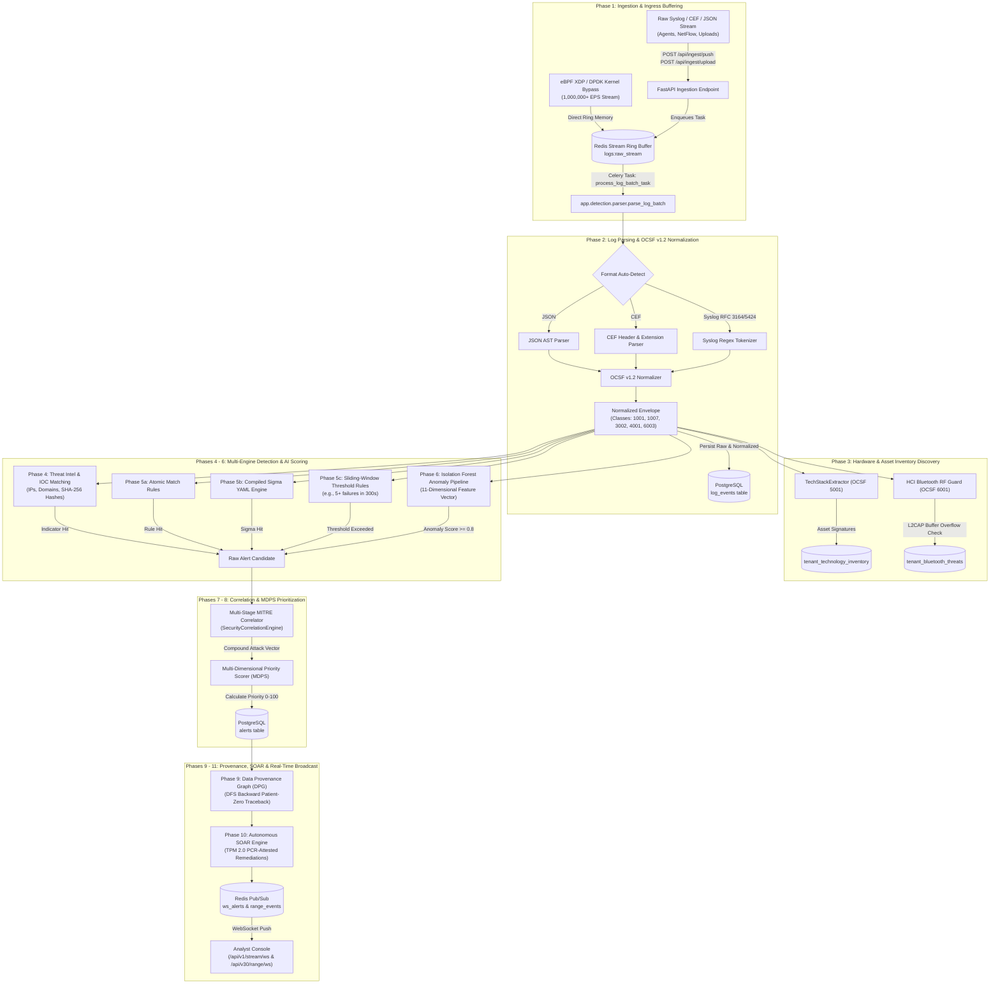
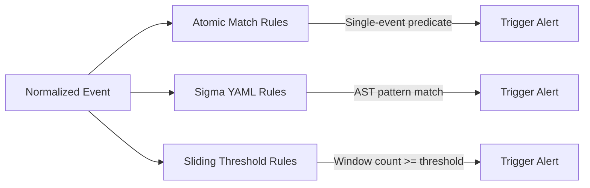
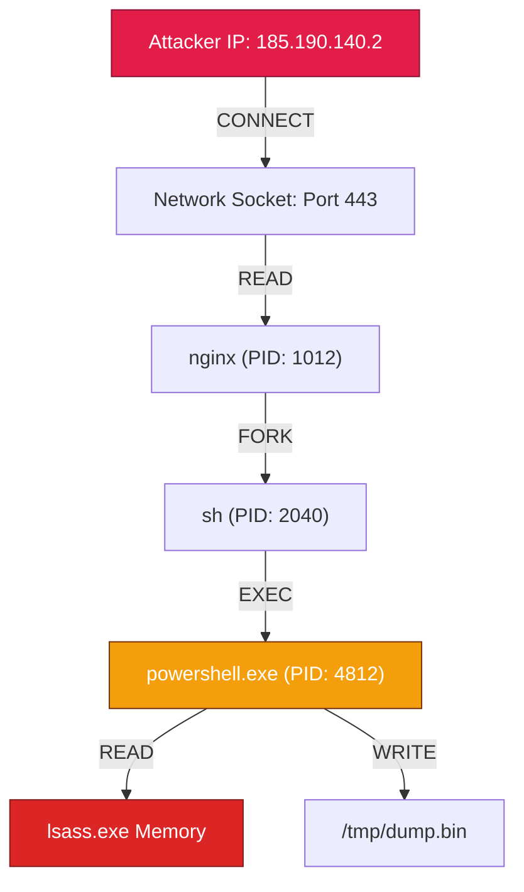

# ⚡ Threat Analyser: End-to-End Threat Detection Pipeline Flow

**Document Focus:** Deep-Dive Technical Specification of the Ingestion, Normalization, Correlation, Machine Learning, and Autonomous SOAR Execution Pipeline  
**Platform Version:** v1.0 – v30.0  
**Target Audience:** Principal Security Engineers, Detection Engineers, Distributed Systems Architects, and SOC Analysts  

---

## 1. Pipeline Architectural Overview

The Threat Analyser detection pipeline is an asynchronous, multi-stage event processing fabric. It transforms raw, heterogeneous edge logs into normalized **Open Cybersecurity Schema Framework (OCSF v1.2)** events, matches them against global and private threat intelligence, evaluates Sigma and stateful threshold rules, computes multi-dimensional machine learning anomaly scores, traces causal attack graphs to Patient Zero, and executes TPM 2.0 hardware-signed SOAR playbooks in milliseconds.

### End-to-End Pipeline Flow Diagram



---

## 2. Phase-by-Phase Technical Walkthrough

### Phase 1: Ingestion & Ingress Buffering

The ingestion subsystem decouples external clients from internal compute-intensive parsing:
- **Kernel-Bypass Ingestion (eBPF XDP / DPDK):** For ultra-high volume streams (1,000,000+ Events Per Second), packets are captured directly from NIC queues into a memory-mapped ring buffer in userspace, bypassing kernel socket overhead entirely.
- **Asynchronous HTTP Ingestion:**
  - `POST /api/ingest/push`: Receives real-time telemetry from endpoint agents. Validates `X-API-Key` in under 2ms.
  - `POST /api/ingest/upload`: Accepts multi-part files containing batch logs (CEF, JSON, Syslog).
- **Decoupled Buffer:** The endpoint writes the payload directly into Redis Stream `logs:raw_stream:{tenant_id}` and dispatches an asynchronous task via Celery:
  ```python
  # Dispatched asynchronously to prevent HTTP request blocking
  process_log_batch_task.delay(org_id=org.id, device_id=device.id, raw_text=batch_content)
  ```
- **Response:** The client receives an immediate `HTTP 202 Accepted` response with an ingestion batch tracking token.

---

### Phase 2: Log Parsing & OCSF v1.2 Normalization

The ingestion worker executes `process_log_batch()` in `app/detection/pipeline.py`:

1. **Format Auto-Detection:**
   - Evaluates incoming raw log strings against JSON object parsers, Common Event Format (`CEF:Version|Device Vendor|...`), and Syslog (RFC 3164 BSD syslog / RFC 5424 IETF syslog) grammars.
2. **OCSF v1.2 Event Taxonomy Mapping:**
   - Normalizes parsed records into standardized Open Cybersecurity Schema Framework structures:

```json
{
  "metadata": {
    "version": "1.2.0",
    "class_name": "PROCESS_ACTIVITY",
    "class_uid": 1007,
    "category_name": "System Activity",
    "category_uid": 1
  },
  "severity_id": 3,
  "activity_id": 1,
  "ts": "2026-09-06T02:00:00.000000Z",
  "actor": {
    "user": {
      "name": "service_admin",
      "uid": "1002"
    }
  },
  "process": {
    "name": "powershell.exe",
    "cmd_line": "powershell.exe -EncodedCommand IAAgAC...",
    "pid": 4812,
    "parent_process": {
      "name": "cmd.exe",
      "pid": 2040
    }
  },
  "device": {
    "hostname": "dc01.corp.internal",
    "ip": "10.200.0.1"
  }
}
```

3. **Persistent Staging:**
   - Raw and normalized JSON records are committed to the `log_events` PostgreSQL table with foreign key linkage to the tenant `org_id`.

---

### Phase 3: Hardware Sensor & Inventory Discovery

Telemetry is audited in parallel for passive asset classification and physical edge threats:

1. **Technology Inventory Extraction (`TechStackExtractor`, OCSF Class 5001):**
   - Examines process command lines and network ports to identify active runtimes and servers (e.g., PostgreSQL, Redis, Node.js, Nginx, Python, Docker).
   - Upserts discovered assets into `tenant_technology_inventory` with confidence ratings and environment tags (`production`, `staging`).
2. **Bluetooth RF Edge Guard (`HCI Guard`, OCSF Class 6001):**
   - Scans L2CAP radio packets for synthetic buffer overflow attacks (e.g., BlueBorne).
   - If an oversized or malformed frame is intercepted, writes a `BLOCKED` record to `tenant_bluetooth_threats` and triggers an immediate containment alert.

---

### Phase 4: Threat Intelligence & IOC Matching

Normalized fields (`src_ip`, `dest_ip`, `file.hash`, `domain`, `process.name`) are checked against known threat indicators (`match_iocs()` in `app/detection/ioc_matcher.py`):

```
                        [Normalized OCSF Event]
                                   │
                                   ▼
        ┌─────────────────────────────────────────────────────┐
        │             In-Memory IOC Matching Engine           │
        ├──────────────────────────┬──────────────────────────┤
        │ Indicator Type           │ Evaluation Method        │
        ├──────────────────────────┼──────────────────────────┤
        │ IPv4 / IPv6              │ Exact Match & CIDR Subnet│
        │ Domain / FQDN            │ Case-Insensitive Suffix  │
        │ MD5 / SHA-1 / SHA-256    │ Exact Hash Lookup        │
        │ File Path / Regex        │ Compiled Regex Engine    │
        └──────────────────────────┴──────────────────────────┘
```

- **Tenant Isolation Strategy:** Queries evaluate:
  ```sql
  WHERE (org_id = :tenant_org_id OR org_id IS NULL)
  ```
  Global threat indicators (`org_id IS NULL`) are inherited by all tenants, while private customer indicators remain strictly compartmentalized.

---

### Phase 5: Multi-Paradigm Rule Engine

Events pass through three distinct rule engines:



1. **Atomic Match Rules (`evaluate_match_rule`):**
   - Evaluates boolean conditions against single events (e.g., `event_type == "auth_failure" AND user == "root"`).
2. **Sigma Rules Compiler (`evaluate_sigma_rule`):**
   - Parses open-source Sigma YAML detection signatures into compiled Abstract Syntax Trees (ASTs).
   - Supports modifiers: `|endswith`, `|contains`, `|startswith`, `|re` (regular expressions), and Base64-encoded command lines.
3. **Stateful Sliding-Window Threshold Rules (`evaluate_threshold_rule`):**
   - Tracks temporal clusters across multiple batches (e.g., *“$\ge 5$ failed SSH authentication attempts from a single `src_ip` within 300 seconds”*).
   - Evaluates active counts against database lookbacks to catch brute-force attempts spread across separate upload chunks.

---

### Phase 6: Unsupervised Machine Learning Anomaly Detection

Events are evaluated by an unsupervised **Isolation Forest** pipeline (`app/detection/anomaly_pipeline.py`):

#### 11-Dimensional Feature Extraction Vector:
Each event is transformed into a continuous numerical vector:
$$\mathbf{x} = \begin{bmatrix}
x_1: \text{Normalized Hour of Day } (\frac{\text{hour}}{24}) \\
x_2: \text{Day of Week } (\frac{\text{weekday}}{7}) \\
x_3: \text{Shannon Entropy of Process / Payload String } (-\sum p_i \log_2 p_i) \\
x_4: \text{Normalized Payload Byte Size} \\
x_5: \text{Destination Port Risk Tier } (0.1 = \text{Standard}, 0.9 = \text{High-Risk Ephemeral}) \\
x_6: \text{Historical Authentication Failure Frequency} \\
x_7: \text{Process Tree Depth Level} \\
x_8: \text{Inbound / Outbound Traffic Byte Ratio} \\
x_9: \text{Obfuscation Indicator Ratio } (\%, \$, \text{Base64 characters}) \\
x_{10}: \text{Privilege Escalation Vector Flag } (0.0 \text{ or } 1.0) \\
x_{11}: \text{External Geolocation Lat/Long Deviation Score}
\end{bmatrix}$$

#### Model Scoring:
- Evaluates tree traversal depths across an ensemble of 100 isolation trees:
  $$s(\mathbf{x}, n) = 2^{-\frac{\mathbb{E}(h(\mathbf{x}))}{c(n)}}$$
  where $h(\mathbf{x})$ is the path length and $c(n)$ is the average path length of unsuccessful searches in a Binary Search Tree.
- If anomaly score $s \ge 0.8$, flags event as an acute statistical outlier and generates an explainable finding breakdown.

---

### Phase 7: Multi-Stage MITRE ATT&CK Threat Correlation

Individual alert hits are ingested into the stateful `SecurityCorrelationEngine`:
- **Compound Attack Chain Synthesis:** Correlates alerts occurring across connected devices or identical user accounts within a 60-minute sliding window:
  ```
  [TA0001: Initial Access] ──► [TA0002: Execution] ──► [TA0006: Credential Access] ──► [TA0010: Exfiltration]
  ```
- If multi-stage progression is identified, synthesizes a **Compound Critical Incident Alert** (e.g., *"APT29 CozyBear Multi-Stage Intrusion Sequence Detected"*).

---

### Phase 8: Multi-Dimensional Priority Scoring (MDPS)

Every alert is scored using the **MDPS Algorithm** (`app/detection/priority_scorer.py`):

$$\text{MDPS} = \min\left(100, \; \Big(w_{\text{base}} \cdot S_{\text{rule}} + w_{\text{ioc}} \cdot S_{\text{ioc}} + w_{\text{ml}} \cdot S_{\text{ml}}\Big) \times \text{CriticalityMultiplier} \times \text{VelocityFactor}\right)$$

| Severity Tier | MDPS Score Range | Operational SLA | Automated Action |
|---|---|---|---|
| **P1 - Critical** | $85 - 100$ | $< 5\text{ minutes}$ | Immediate SOAR Isolation & PagerDuty Dispatch |
| **P2 - High** | $70 - 84$ | $< 30\text{ minutes}$ | Automated Credential Rotation & SOC Queue Escalation |
| **P3 - Medium** | $40 - 69$ | $< 2\text{ hours}$ | Added to Investigation Worklist |
| **P4 - Low / Informational** | $0 - 39$ | $< 24\text{ hours}$ | Stored for Baseline Anomaly Training |

---

### Phase 9: Causal Data Provenance Graph (DPG) & Patient-Zero Traceback

The system builds a directed acyclic graph (DAG) representing system causality (`app/detection/provenance_tracker.py`):



- **Backward Depth-First Search (DFS) Traceback:** When an alert fires on `powershell.exe reading lsass.exe`, the engine traverses backward along parent and socket edges to identify the original ingress vector (Patient Zero: `185.190.140.2 -> nginx`).

---

### Phase 10: Autonomous SOAR Remediation & TPM 2.0 Attestation

Upon confirming a P1/Critical incident, the **SOAR Engine** (`app/services/soar_engine.py`) executes automated mitigation tasks:

```yaml
# Declarative SOAR Playbook Structure
playbook_name: "Isolate Ransomware Endpoint"
trigger_condition:
  severity: "critical"
  mitre_tactic: "TA0040" # Impact
actions:
  - step: 1
    type: "PROCESS_KILL"
    target: "malicious_process_tree"
  - step: 2
    type: "NETWORK_ISOLATE"
    target: "device_interface"
  - step: 3
    type: "ROTATE_CREDENTIALS"
    target: "compromised_device_api_key"
```

- **TPM 2.0 Hardware Attestation:** Remediation instructions are signed using Platform Configuration Registers (PCRs). The device's local hardware TPM validates that the containment order originated from an authentic Threat Analyser controller before isolating local network interfaces.

---

### Phase 11: Real-Time Event Broadcast & WebSocket Distribution

Alerts and pipeline telemetry are dispatched to analyst consoles without browser polling:
1. Workers publish notifications to Redis Pub/Sub channels (`range_events`, `tenant:{org_id}:range_updates`, `ws_alerts`).
2. The FastAPI WebSocket Broadcaster (`app/api/ws.py`, `app/api/ws_cyber_range.py`) pushes JSON payloads to active browser connections:
   - `/api/v1/stream/ws`: Live alert triage notifications.
   - `/api/v30/range/ws`: Cyber range simulation steps, Merkle-chain hashes, and scorecard updates.
   - `/api/v1/provenance/ws`: Live Causal Provenance node and edge updates.

---

## 3. Pipeline Performance Metrics & Benchmarks

| Pipeline Stage | Processing Latency | Throughput Capacity | Resource Bottleneck |
|---|---|---|---|
| **eBPF XDP Ingress** | $2.4\text{ }\mu\text{s}$ | $1,000,000+\text{ EPS}$ | Physical NIC Bandwidth |
| **HTTP Decoupled Ingest** | $1.8\text{ ms}$ | $50,000\text{ EPS / Node}$ | Redis Ring Buffer I/O |
| **OCSF Parse & Normalize** | $0.4\text{ ms / event}$ | $25,000\text{ EPS / Worker}$ | CPU Tokenizer |
| **IOC Exact Match** | $0.05\text{ ms / event}$ | $100,000\text{ EPS / Worker}$ | In-Memory Hash Tables |
| **Sigma & Rule Engine** | $1.2\text{ ms / batch}$ | $10,000\text{ EPS / Worker}$ | AST Depth & Regexes |
| **Isolation Forest ML** | $3.5\text{ ms / batch}$ | $5,000\text{ EPS / Worker}$ | NumPy Vector Matrix |
| **SOAR Dispatch & Sign** | $45\text{ ms / incident}$ | On-Demand Event-Driven | TPM 2.0 Hardware Call |
| **WebSocket Delivery** | $1.1\text{ ms}$ | Real-Time Push | Network TCP Congestion |

---

*End of Threat Detection Pipeline Specification.*
